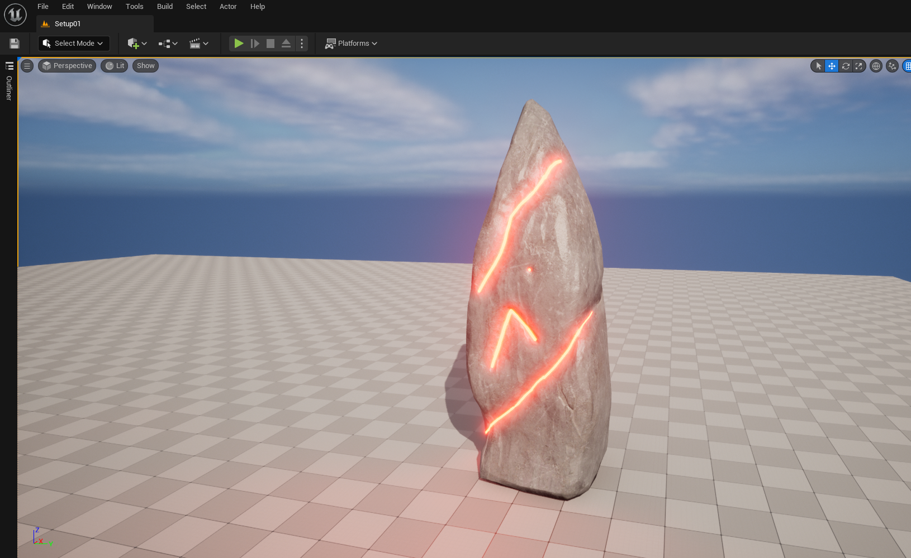
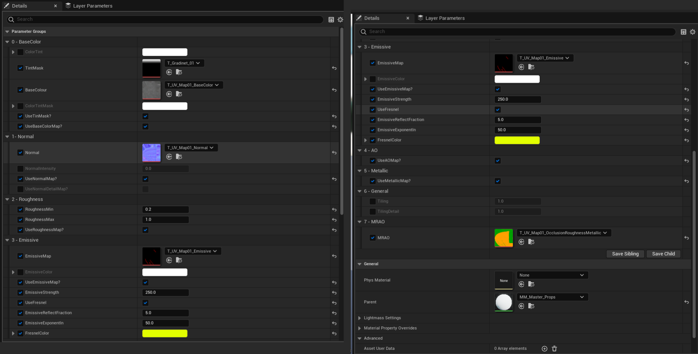

<h1>Unreal Master Material for Props</h1>

<h3>Introduction:</h3>

The Unreal Master Material for Props is a standard material for creating 3D props in Unreal Engine 5. It includes various customizable features for creating a wide range of variations.
It has been Created Using Two Material Functions.

  

1. MF_Standard_MRAO this function has an MRAO mask map separated and all Metallic, Roughness, and AO can be added in value numeric way and could be controlled with a numeric value. Roughness will be managed with Roughnessmin and max. This Function has also Normal with a normal detail map and both values can be adjusted. Base Color with Basecolortintmask and a custom color in both tint and color.
2. MF_MasterParams In this function parameters and TextureParameter it set up in material attributes.
3. MM_MasterMaterial_props here MF_MasterParams is attached to MF_MasterParams. User Can right-click and make this material as a material instance and can be used all these tools will be available in a material instance which users will be able to work with for his/her projects/assets.

<h3>Material Structure in Instance :</h3>

The material instance includes several groups:

Group 0: BaseColor
This group includes nodes for adjusting the base color, color tint, tint mask, and color tint mask. UseTintMask is a Boolean node that determines whether the tint mask is applied. UseBaseColorMap is another Boolean node that determines whether a BaseColor map is used to add texture or pattern to the base color.

Group 1: Normal
This group includes nodes for adjusting the normal map and its intensity. NormalDetailMap is also included.

Group 2: Roughness
This group includes nodes for adjusting the roughness, including roughness min and max, and whether to use a Roughness map.

Group 3: Emissive
This group includes nodes for adjusting the emissive map, emissive color, emissive strength, and whether to use an emissive map. UseFresnel is a Boolean node that determines whether to use the Fresnel effect, which adjusts the reflectivity of the emissive material based on the viewing angle. EmissiveReflectFraction and EmissiveExponentln are additional nodes for adjusting the emissive reflectivity and exponent values. FresnelColor is also included.

Group 4: AO
This group includes nodes for adjusting the ambient occlusion (AO) value and AO map.

Group 5: Metallic
This group includes nodes for adjusting the metallic value and metallic map.

Group 6: General
This group includes nodes for adjusting the tiling of the base texture, detail normal, and other parts of the material.

Group 7: MRAO
This group includes nodes for adjusting the MRAO (metallic-roughness-ambient occlusion) values.

Conclusion:
The Unreal Master Material for Props is a versatile material that allows users to create realistic props with customizable features. By using this material, users can add depth and detail to their Unreal Engine projects Also there is one more function which i added opacity by adding it users can add an Opacity mask too.
